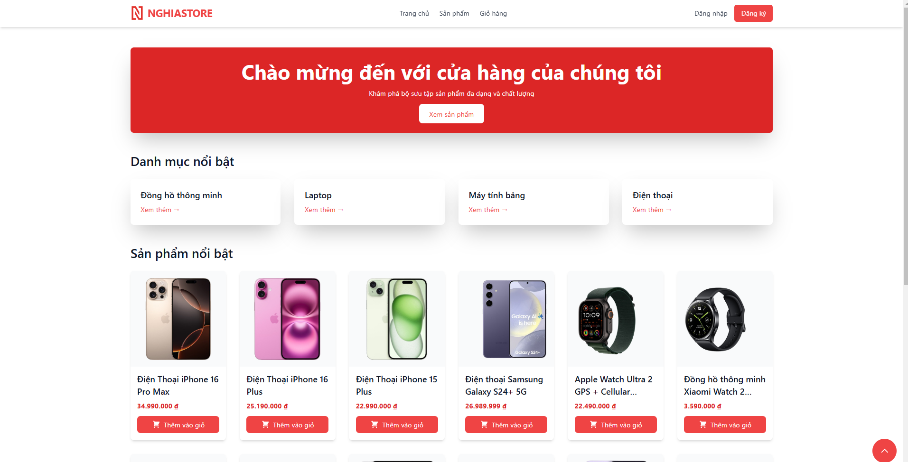
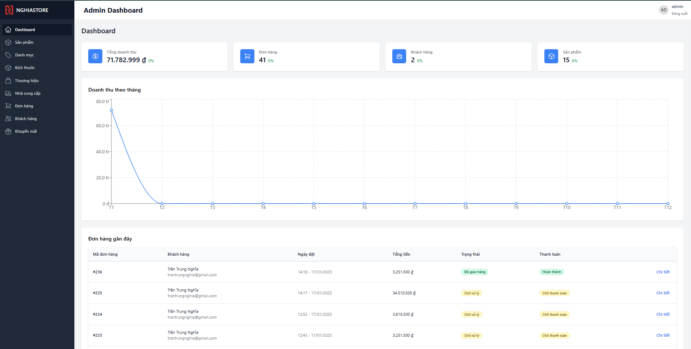

# 🛍️ Website Thương mại điện tử bán đồ công nghệ

<div align="center">


</div>

<div align="center">
  
  <p><i>Website thương mại điện tử hiện đại bán các sản phẩm công nghệ</i></p>
</div>

## ✨ Preview

<div align="center">
  
  
</div>

## 🎯 Tính năng nổi bật

### 👥 Phần người dùng (Client)

-   🔐 **Xác thực**: Đăng ký, đăng nhập và quên mật khẩu
-   🔍 **Tìm kiếm**: Tìm kiếm sản phẩm với bộ lọc đa dạng
-   📱 **Responsive**: Tương thích với mọi thiết bị
-   🛒 **Giỏ hàng**: Quản lý giỏ hàng và thanh toán
-   📦 **Đơn hàng**: Theo dõi trạng thái đơn hàng
-   ⭐ **Đánh giá**: Bình luận và đánh giá sản phẩm
-   👤 **Cá nhân**: Quản lý thông tin tài khoản

### 👨‍💼 Phần quản trị (Admin)

-   📊 **Dashboard**: Thống kê doanh thu và đơn hàng
-   📝 **Quản lý sản phẩm**: Thêm, sửa, xóa sản phẩm
-   🏷️ **Danh mục**: Quản lý danh mục và thương hiệu
-   📦 **Đơn hàng**: Xử lý và theo dõi đơn hàng
-   👥 **Người dùng**: Quản lý tài khoản người dùng
-   🎫 **Khuyến mãi**: Tạo và quản lý mã giảm giá

## 🛠️ Công nghệ sử dụng

### Frontend


### Backend


## 📁 Cấu trúc dự án

```bash
src/
├── frontend-home/ # Frontend cho người dùng
│ ├── public/ # Static files
│ ├── src/
│ │ ├── components/ # React components
│ │ ├── pages/ # Page components
│ │ ├── contexts/ # React contexts
│ │ ├── hooks/ # Custom hooks
│ │ └── services/ # API services
│
├── frontend-dashboard/ # Frontend cho admin
│ ├── src/
│ │ ├── components/ # Admin components
│ │ ├── pages/ # Admin pages
│ │ └── services/ # Admin services
│
└── backend/ # Backend API
├── controllers/ # Route controllers
├── models/ # Database models
├── routes/ # API routes
└── middlewares/ # Custom middlewares
```

## 🚀 Hướng dẫn cài đặt

### Yêu cầu hệ thống

-   Node.js >= 14.0.0
-   MySQL >= 8.0
-   npm >= 6.0.0

### Các bước cài đặt

1. Clone repository

```bash
git clone https://github.com/your-username/cn-da21ttb-trantrungnghia-ecommercewebsite-reactjs.git
```

2. Cài đặt dependencies

```bash
Backend
cd backend
npm install

Frontend người dùng
cd frontend-home
npm install

Frontend admin
cd frontend-dashboard
npm install
```

3. Cấu hình môi trường

```bash
Tạo file .env trong thư mục backend
Cập nhật các biến môi trường

DB_HOST=localhost
DB_USER=your_username
DB_PASS=your_password
DB_NAME=ecommerce
JWT_SECRET=your_secret_key
```

4. Import database

```bash
mysql -u root -p < src/database/ecommanagement.sql

```

## 📱 Responsive Design

Website được thiết kế để tương thích với các thiết bị:
- 💻 Desktop (>= 1024px)
- 📱 Tablet (768px - 1023px)
- 📱 Mobile (< 768px)

## 📧 Contact Form

Để cấu hình form liên hệ:
1. Cập nhật `SMTP_CONFIG` trong `.env`
2. Khởi động email service trong backend
3. Test gửi email thử nghiệm

## 👤 Tác giả

**Trần Trung Nghĩa**
- 🌐 Website: [trungnghia03tv.vercel.app](https://trungnghia03tv.vercel.app)
- 📧 Email: trantrungnghia03.tv@gmail.com
- 🐱 GitHub: [@trantrungnghia](https://github.com/trantrungnghia414)
- 📞 Facebook: [@trantrungnghia](https://www.facebook.com/lucky.nghia.5)
- 📞 Instagram: [@trantrungnghia](https://www.instagram.com/trantrungnghia03)
- 📞 Zalo: [@trantrungnghia](https://zalo.me/0929039414)

## 📝 License

Copyright © 2024 [Trần Trung Nghĩa](https://github.com/trantrungnghia414).<br />
Project này được cấp phép theo giấy phép [MIT](LICENSE).

---
<div align="center">
Made with ❤️ by Trần Trung Nghĩa
</div>